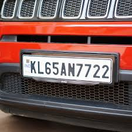
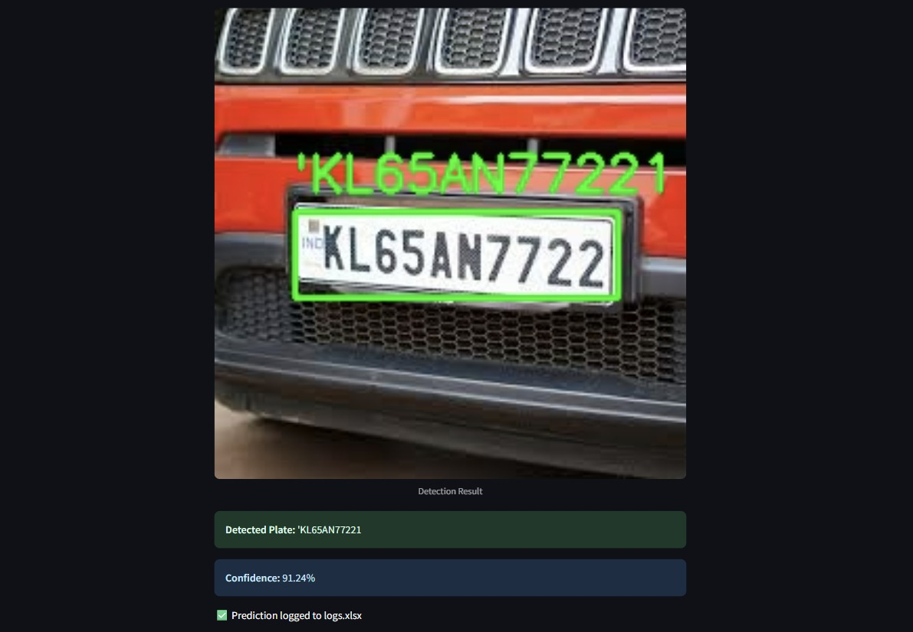
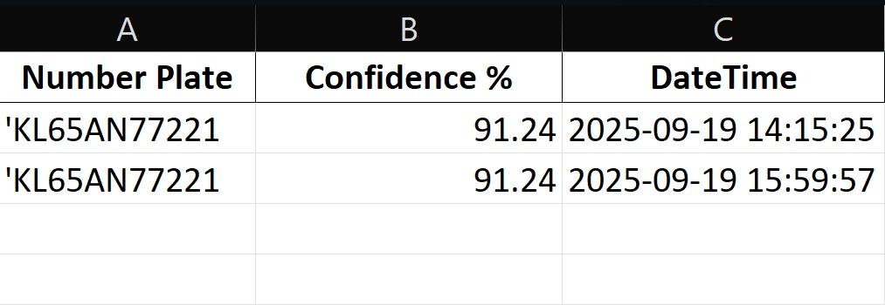

# 🚗 Automatic Number Plate Recognition System

This project is an **Automatic Number Plate Recognition (ANPR) System** that detects car number plates from images and extracts the text. It uses:

* [YOLOv8](https://github.com/ultralytics/ultralytics) for license plate detection
* [EasyOCR](https://github.com/JaidedAI/EasyOCR) for reading the number plate text
* [Streamlit](https://streamlit.io/) to build an interactive web interface

The workflow is simple: an image of a car is uploaded → YOLOv8 detects the license plate → EasyOCR extracts the text → results are shown in the app and logged into an Excel file.

---

## 📸 Demo

Upload an image of a vehicle and get the detected number plate along with the extracted text:




---

## 📊 Output

Below is an example of the system detecting and recognizing a license plate from an image:




Here is the updated excel sheet:




---

## ⚙️ Installation

Clone the repository and install dependencies:

```bash
git clone https://github.com/pram1t/Automatic-Nuber-Plate-Detection-and-Logging-system.git
cd anpr-system
pip install -r requirements.txt
```

---

## ▶️ How to Run

1. **Train the model**: Open and run the `main.ipynb` Jupyter Notebook to train the YOLOv8 model with your dataset. This step is crucial for generating the model weights.

```bash
jupyter notebook main.ipynb
```

2. **Launch the application**: Once the model is trained, you can start the Streamlit application to use the model.

```bash
streamlit run app.py
```

Then open the local URL shown in your terminal (usually `http://localhost:8501`).

---

## 📂 Project Structure

```
├── dataset/    
│   └── annotations     # .xml annotations of cars
│   └── images          # Images of cars        
├── main.ipynb          # YOLOv8 training notebook
├── app.py              # Streamlit app
├── train.ipynb         # YOLOv8 training notebook
├── requirements.txt    # Project dependencies
└── README.md           # This file
```

---

## ⚠️ Disclaimer

Only a few sample images are included in the `dataset/` folder for demonstration purposes.  
For complete training, download the full dataset from Kaggle here:  
👉 [Car Plate Detection Dataset](https://www.kaggle.com/datasets/andrewmvd/car-plate-detection/data)

---

